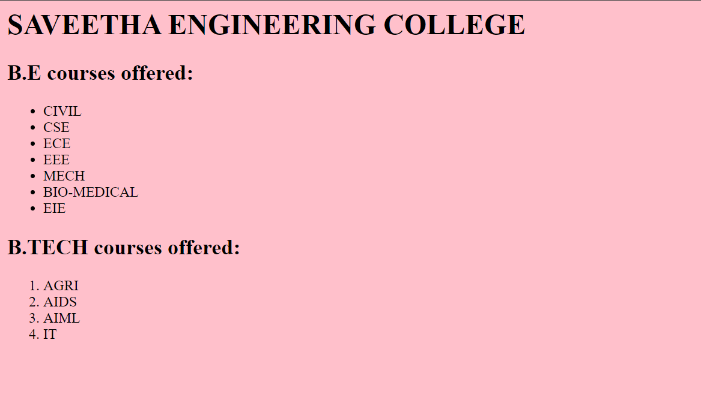

# Ex.02 Implementation of Lists
## AIM
  To create list of Departments in an Institution.

## ALGORITHM
### STEP-1
  Open notepad and type the HTML code.

### STEP-2
  Create an ordered list using ```<ol>``` tag.

### STEP-3
  List the Departments using ```<li>``` tag.

### STEP-4
  Create an unordered list using ```<ul>``` tag for nesting lists.

### STEP-5
  Open the file in a browser and verify the output.
  
## CODE
```
<html>
    <head>
        <title>list</title>
    </head>
    <body bgcolor="pink">
        <h1 >SAVEETHA ENGINEERING COLLEGE </h1>
        <h2 > B.E courses offered:</h2>
        <ul>
            <li>CIVIL</li>
            <li>CSE</li>
            <li>ECE</li>
            <li>EEE</li>
            <li>MECH</li>
            <li>BIO-MEDICAL</li>
            <li>EIE</li>
        </ul>
        <h2>B.TECH courses offered:</h2>
        <ol>
            <li>AGRI</li>
            <li>AIDS</li>
            <li>AIML</li>
            <li>IT</li>
        </ol>


            
    

    </body>
</html>
```
## OUTPUT


## RESULT
  List of Departments in an Institution is created successfully.
